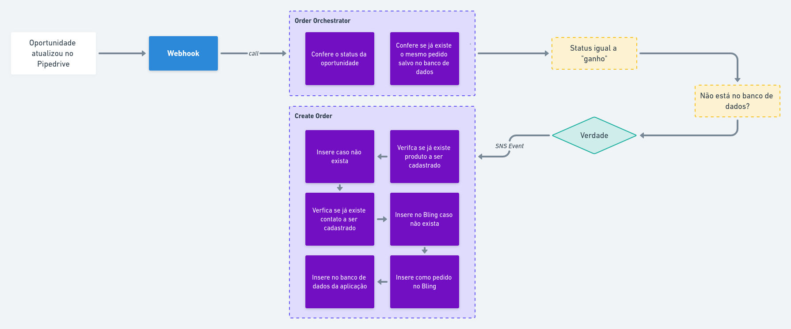

# Serverless API - Integração de CRM com ERP
Integração com Pipedrive e Bling.  

### Tecnologias:
- Nodejs 12.x
- Serverless Framework
- AWS Lambda - *Possui escalabilidade e baixo custo*
- AWS SNS - *Utilizado para invocar outras funções, possui baixa latência e tem alta confiabilidade*
- MongoDB

## Fluxo:
Cria um pedido no Bling sempre que o status do *negócio* no Pipedrive é alterado para "ganho".   
Pipedrive dispara um webhook quando o *negócio* é atualizado, a aplicação confere o status do mesmo e insere no Bling como pedido.



## Executar projeto:
Antes de tudo é necessário seguir os passos de instalação do [Serverless Framework](https://www.serverless.com/framework/docs/providers/aws/guide/installation/),
e preencher as variáveis de ambiente localizadas no arquivo ```serverless.yml``` na raiz da aplicação.  
**Exemplo:**
```
...
provider:
  ...
  environment:
    DATABASE_URL: #DATABASE URL HERE
    ERP_URL: ...
    ERP_API_KEY: # ERP API KEY HERE
```

Após o procedimento anterior, é necessário executar ```yarn``` para instalar as dependências do projeto.
E então executar ```sls offline``` para rodar o Serverless Framework em modo offline.  

Por padrão a aplicação rodará na porta ```3000``` e o serviço de SNS na porta ```4002```.


## Endpoints:
### POST ```/orders```
Webhook que o Pipedrive chamará para criar ou não o pedido no Bling, portanto é necessário que esse endpoint seja cadastrado como webhook no 
próprio Pipedrive ([documentação no Pipedrive](https://developers.pipedrive.com/docs/api/v1/#!/Webhooks/addWebhook))  

**Api do Pipedrive**  
Para funcionar é necessário que seja enviado no body do **cadastro de webhooks do Pipedrive** da seguinte forma:
```
{
  subscription_url: '{api_url}/orders',
  event_action: 'updated',
  event_object: 'deal'
}
```

### GET ```/orders```
Retorna todos os pedidos inseridos no Bling que estão salvos no banco de dados.  
Possui paginação.

**Queries:**
```
// Todas as queries são OPCIONAIS
{
  page: number,
  limit: number
} 
